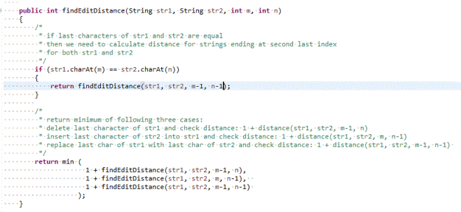
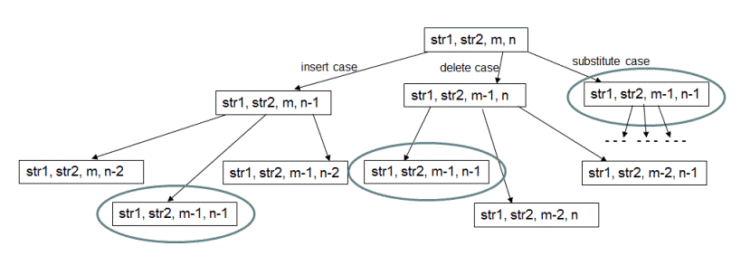
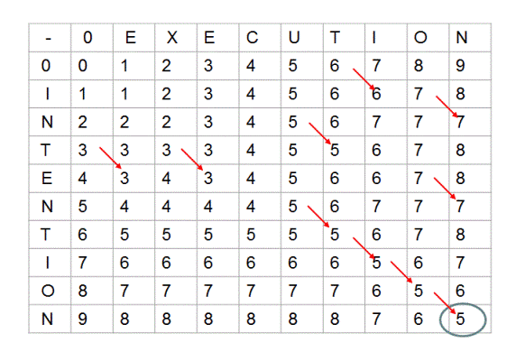

```java
public class EditDistanceStrings 
{
    final static int ERROR_INPUT = -1;
    
    private int min(int a, int b)
    {
        return (a<b)?a:b;
    }
    
    private int min(int a, int b, int c)
    {
        return min(min(a,b),c);
    }
    
    public int findDistance(String str1, String str2, int m, int n)
    {
         
        if (str1 == null || str2 == null)
        {
            return ERROR_INPUT;
        }
            
         
        if (m == 0)
        {
            return n;
        }
        
         
        if (n == 0)
        {
            return m;
        }
        
         
        if (str1.charAt(m-1) == str2.charAt(n-1))
        {
            return findDistance(str1, str2, m-1, n-1);
        }
        
         
        return min (
                     1 + findDistance(str1, str2, m-1, n),
                     1 + findDistance(str1, str2, m, n-1),  
                     1 + findDistance(str1, str2, m-1, n-1) 
                   );
    }
    
    
    public int findDistance(String str1, String str2)
    {
         
        if (str1 == null || str2 == null)
        {
            return ERROR_INPUT;
        }

         
        int[][] distanceTable = new int[str1.length()+1][str2.length()+1];
        
        int numRows = str1.length() + 1;
        int numCols = str2.length() + 1;
         
        for (int m = 0; m < numRows; m++)
        {
            for (int  n = 0; n < numCols; n++)
            {
                 
                if (m == 0)
                {
                    distanceTable[m][n] = n;
                }
                
                 
                else if (n == 0)
                {
                    distanceTable[m][n] = m;
                }
                
                 
                else if (str1.charAt(m-1) == str2.charAt(n-1))
                {
                    distanceTable[m][n] = distanceTable[m-1][n-1]; 
                }

                 
                else
                {
                    distanceTable[m][n] = min (
                                                1 + distanceTable[m-1][n],
                                                1 + distanceTable[m][n-1],
                                                1 + distanceTable[m-1][n-1]
                                              );
                }
            }
        }
        
        return distanceTable[numRows-1][numCols-1];
    }
    
    
    public static void main(String[] args) 
    {
        EditDistanceStrings solution = new EditDistanceStrings();

        System.out.print("minimum edit distance between \"intention\" and \"execution\" is: \n" );
        System.out.println(solution.findDistance("intention" , "execution" ));
    }
}
```




